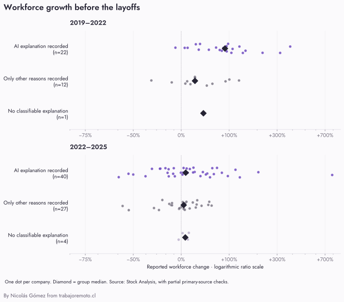
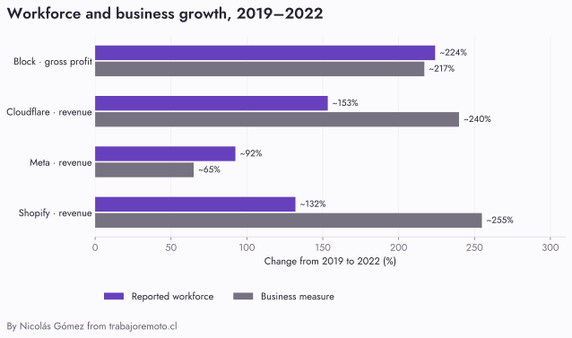

# ¿Las empresas que vinculan sus recortes con IA habían crecido más?

*Investigación exploratoria · 17 de septiembre de 2026*

**El grupo vinculado con IA creció más en 2019–2022, pero no en 2022–2025.** La expansión previa de plantilla aparece tanto en empresas con explicaciones vinculadas a IA como en empresas cuyos anuncios ofrecen otras explicaciones.

Cruzamos las causas de los anuncios con historiales de plantilla. Recuperamos pares utilizables para **71 empresas en 2022–2025** y **35 en 2019–2022**, de las 217 empresas de la colección. La comparación se basa principalmente en una compilación secundaria, con comprobaciones parciales en documentos originales. Es evidencia exploratoria: las cifras aún no están armonizadas por adquisiciones, tipo de trabajador ni sector.

[Explorar los anuncios](explorar.html) · [Datos y fuentes en CSV](hiring-research.csv) · [Datos completos y comprobaciones en JSON](hiring-research.json)

## Qué encontramos

Mediana del cambio porcentual de la plantilla reportada. Cada empresa pesa una vez, independientemente del número de anuncios o puestos afectados.

| Período | IA registrada | Solo otras causas | Sin explicación clasificable |
|---|---:|---:|---:|
| 2019–2022 | **+79,8%** · 15 empresas | **+50,9%** · 18 empresas | **+67,4%** · 2 empresas |
| 2022–2025 | **+3,7%** · 28 empresas | **+4,7%** · 38 empresas | **+10,2%** · 5 empresas |

**«IA registrada» significa que al menos un anuncio del semestre tiene una razón vinculada con IA atribuida en las fuentes**, incluida la transición hacia IA sin mayor detalle. Se utiliza el mismo criterio que en el artículo y el explorador. No basta con que la empresa venda IA o la mencione como contexto. «Solo otras causas» incluye las demás razones sin un vínculo atribuido con IA; no prueba ausencia de IA. Quienes no tienen una explicación clasificable forman un grupo separado.

La clasificación conserva quién hace la afirmación. Por ejemplo, el vínculo de Salesforce en febrero procede de un analista externo. Amdocs entra en el grupo de IA por la transición atribuida en la cobertura, aunque el papel concreto de la IA siga sin precisarse. Los grupos comparan explicaciones publicadas, no efectos demostrados.

*Las figuras conservan el inglés. El eje utiliza una escala logarítmica de la razón entre plantillas para mostrar expansiones y contracciones sin ocultar las empresas más pequeñas detrás de los valores extremos. [Abrir la figura](assets/hiring-distribution.svg).* 

Entre 2019 y 2022, **6 de las 15 empresas con IA registrada habían al menos duplicado su plantilla**, frente a **4 de las 18 con otras causas**. Es una diferencia descriptiva que merece atención, pero procede de un subconjunto pequeño y desigual. Angi, por ejemplo, figura en el grupo de IA aunque su plantilla reportada había disminuido en ese período.

Entre 2022 y 2025, **12 de las 28 empresas con IA registrada ya habían reducido su plantilla neta**. También habían disminuido 14 de las 38 con otras causas. No hay una única trayectoria de expansión continua hasta el anuncio de 2026.

## Cuánto depende del período y de las empresas incluidas

| Comparación | IA registrada | Solo otras causas |
|---|---:|---:|
| 2019–2022: excluir operaciones societarias documentadas | +65,5% · n=13 | +50,9% · n=14 |
| 2022–2025: mismas empresas presentes en ambos períodos | +3,5% · n=15 | +5,2% · n=15 |
| 2022–2025: solo observaciones de diciembre | -12,6% · n=18 | +3,7% · n=27 |
| 2022–2025: excluir diferencias conocidas de definición o alcance | +3,5% · n=27 | +5,3% · n=34 |

Al limitar la comparación a observaciones de diciembre, el grupo de IA presenta una mediana negativa y el de otras razones una positiva. Eso no demuestra que el calendario fiscal explique los despidos; **al restringir las fechas también cambia la composición del grupo**. Entre las mismas empresas observables en ambos períodos, las medianas de crecimiento reciente son aproximadamente 3,5% y 5,2%.

Las exclusiones por operaciones societarias utilizan solo las operaciones documentadas en esta revisión. No equivalen a un ajuste del crecimiento orgánico ni a una revisión exhaustiva de todas las adquisiciones. Las comprobaciones completas, incluidos tamaños de grupo, están en la descarga JSON.

La lectura respaldada es limitada: algunas comparaciones muestran mayor expansión previa en el grupo de IA, pero estas cifras no sostienen una caracterización general de ese grupo como «las empresas que sobrecontrataron».

## Más plantilla no significa necesariamente exceso de contratación

Los resultados del negocio cambian la interpretación. Estos cuatro casos ilustran esa diferencia; no son una muestra con la que estimar una relación para toda la colección.

| Empresa | Plantilla, 2019–2022 | Medida del negocio, 2019–2022 |
|---|---:|---:|
| Block | ≈ +224% | Beneficio bruto: ≈ +217% |
| Cloudflare | ≈ +153% | Ingresos: ≈ +240% |
| Meta | ≈ +92% | Ingresos: ≈ +65% |
| Shopify | ≈ +132% | Ingresos: ≈ +255% |

*Variaciones calculadas a partir de cifras reportadas y redondeadas. Shopify incluye contratistas; su base de 2019 se reporta como más de 5.000. Block usa beneficio bruto; las demás filas, ingresos nominales. [Abrir la figura](assets/hiring-business.svg).* 

En Block, la expansión de plantilla y la del beneficio bruto fueron de un orden parecido. En Cloudflare, los ingresos aumentaron más que el personal. En Meta ocurrió lo contrario. Ninguna de esas comparaciones mide por sí sola cuántas personas necesitaba la empresa: influyen las adquisiciones, los precios, la mezcla de productos y las inversiones que todavía no generaban ingresos.

Shopify ofrece un contraste especialmente útil: sus ingresos crecieron más que su plantilla entre esos dos cierres, y aun así su CEO reconoció una apuesta equivocada por la persistencia del auge del comercio electrónico al anunciar recortes en julio de 2022. Un cociente simple entre ingresos y empleados tampoco resuelve la pregunta.

Fuentes financieras: Block [2019](https://www.sec.gov/Archives/edgar/data/1512673/000119312520050074/d888202dex991.htm) y [2022](https://investors.block.xyz/files/doc_financials/2022/q4/Block_Shareholder-Letter-4Q22.pdf); Cloudflare [2019](https://cloudflare.net/files/doc_financials/2019/q4/NET-Q419-Earnings-Press-Release.pdf) y [2022](https://www.cloudflare.com/en-gb/press/press-releases/2023/cloudflare-announces-fourth-quarter-and-fiscal-year-2022-financial-results/); Meta [2019](https://investor.atmeta.com/investor-news/press-release-details/2020/Facebook-Reports-Fourth-Quarter-and-Full-Year-2019-Results/default.aspx) y [2022](https://www.sec.gov/Archives/edgar/data/1326801/000132680123000013/meta-20221231.htm); Shopify [2019](https://www.shopify.com/news/shopify-announces-fourth-quarter-and-full-year-2019-financial-results) y [2022](https://www.shopify.com/news/shopify-announces-fourth-quarter-and-full-year-2022-financial-results). Las fuentes de plantilla aparecen en el registro de empresas.

## Sí encontramos reconocimientos anteriores, con fecha

| Empresa | Anuncio al que corresponde | Qué reconoció la dirección |
|---|---|---|
| [Shopify](https://www.shopify.com/news/changes-to-shopify-s-team) | Julio de 2022 | Amplió el equipo apostando por una aceleración duradera del comercio electrónico que no se materializó. |
| [Meta](https://about.fb.com/news/2022/11/mark-zuckerberg-layoff-message-to-employees/) | Noviembre de 2022 | Aumentó la inversión esperando que persistiera el auge de la actividad digital; Zuckerberg reconoció el error de previsión. |
| [Salesforce](https://d18rn0p25nwr6d.cloudfront.net/CIK-0001108524/6460bc13-bdbb-4bd4-a6f4-f7919b884f6b.pdf) | Enero de 2023 | Benioff afirmó explícitamente que habían contratado demasiadas personas durante la aceleración de ingresos de la pandemia. |

Son ejemplos de evidencia directa sobre las explicaciones de la dirección, no un recuento exhaustivo de empresas que reconocieron sobrecontratación. **No se transfieren como causas a los anuncios de 2026.** Lo investigable ahora es si esos anuncios corrigen el mismo exceso, afectan otras funciones o responden a decisiones nuevas.

## Problemas encontrados en los datos de plantilla

**Una fecha incorrecta puede cambiar la historia.** La compilación de MicroVision asigna 350 empleados a diciembre de 2022. El [informe original](https://www.sec.gov/Archives/edgar/data/65770/000119312523056723/d461483d10k.htm) sitúa esa cifra el 24 de febrero de 2023, ya incluyendo empleados incorporados con Ibeo. Excluimos ese caso de los cálculos. También corregimos el día de la observación de Salesforce de enero de 2019 según su [10-K](https://www.sec.gov/Archives/edgar/data/1108524/000110852419000009/crmq4fy1910-k.htm).

**«Empleados» no siempre mide lo mismo.** Shopify incluye contratistas; ASML reporta equivalentes a jornada completa con personal temporal; la serie de Spotify utiliza promedios anuales. Se mantienen señalados en la comparación amplia y se excluyen en una comprobación de sensibilidad. En Amazon y MercadoLibre, la plantilla total también incluye operaciones logísticas: no representa necesariamente las funciones afectadas por un recorte tecnológico.

**Comprar una empresa aumenta la plantilla sin contratar a todas esas personas.** Registramos ejemplos como Afterpay en Block, Mailchimp y Credit Karma en Intuit, Slack en Salesforce y Splunk en Cisco. También hay ventas de unidades, como Egencia en Expedia y el negocio logístico de Shopify. No contamos con un ajuste de empleados incorporados o transferidos para toda la muestra. La descarga identifica las operaciones, sus fechas y sus fuentes; ausencia de una anotación no significa ausencia de adquisiciones.

## Método y cobertura

La colección de 228 anuncios contiene **217 etiquetas de empresa**: 72 con alguna explicación vinculada a IA, 122 con solo otras razones y 23 sin explicación clasificable. No fusionamos subsidiarias con sus matrices ni sustituimos su plantilla por la del grupo. Tampoco garantizamos independencia entre empresas del mismo grupo corporativo.

Buscamos historiales para **88 empresas con una correspondencia identificada con informes de una entidad cotizada o anteriormente cotizada**, sin limitar la búsqueda a la etiqueta bursátil incompleta del dataset. Recuperamos observaciones numéricas para 84. Las otras 129 etiquetas no se incorporaron a esa recopilación de series públicas: eso no demuestra que sus datos sean inaccesibles. Las empresas privadas y las subsidiarias quedan infrarrepresentadas.

| Grupo en los anuncios | Empresas del conjunto | Con par 2019–2022 | Con par 2022–2025 |
|---|---:|---:|---:|
| IA registrada | 72 | 15 | 28 |
| Solo otras causas | 122 | 18 | 38 |
| Sin explicación clasificable | 23 | 2 | 5 |
| Total | 217 | 35 | 71 |

La base amplia procede de las tablas de plantilla de **Stock Analysis**, que declara recopilar cifras de documentos regulatorios y relaciones con inversionistas. Cada observación enlaza su fuente. Las adiciones y comprobaciones primarias se guardan por separado; no presentamos la compilación completa como verificada contra cada documento original. Las cifras tras acceso restringido se dejan sin recuperar y no se imputan.

Para cada año calendario tomamos la última observación numérica disponible dentro de ese año, salvo las correcciones documentadas. Los cierres fiscales pueden caer en meses diferentes; por eso mostramos las fechas y la comprobación limitada a diciembre. Los cambios son **netos de plantilla**, no contrataciones brutas ni despidos acumulados. Una fecha de cierre tampoco coincide necesariamente con el máximo de plantilla o con el día anterior al anuncio de 2026.

El cálculo por empresa es `(plantilla final / plantilla inicial − 1) × 100`. Resumimos con medianas, sin ponderar por tamaño. No calculamos un porcentaje de despidos causado por sobrecontratación ni trasladamos estos resultados a todas las empresas. La selección por disponibilidad, las diferencias sectoriales, las operaciones societarias y la medición desigual de las causas impiden esa extrapolación. Para estudiar el riesgo de despedir haría falta además un grupo de empresas que no anunció recortes.

Ver las empresas y las cifras utilizadas

<table><thead><tr><th>Empresa / grupo</th><th>2019</th><th>2022</th><th>2025</th><th>2019–22</th><th>2022–25</th></tr></thead><tbody><tr><th>ADP <small>Sin explicación clasificable</small></th><td>—</td><td><a href="https://stockanalysis.com/stocks/adp/employees/">60,000</a> <small>2022-06-30</small></td><td><a href="https://stockanalysis.com/stocks/adp/employees/">67,000</a> <small>2025-06-30</small></td><td>—</td><td>+11,7%</td></tr><tr><th>Amazon <small>Solo otras razones registradas</small></th><td><a href="https://stockanalysis.com/stocks/amzn/employees/">798,000</a> <small>2019-12-31</small></td><td><a href="https://stockanalysis.com/stocks/amzn/employees/">1,541,000</a> <small>2022-12-31</small></td><td><a href="https://stockanalysis.com/stocks/amzn/employees/">1,576,000</a> <small>2025-12-31</small></td><td>+93,1%</td><td>+2,3%</td></tr><tr><th>Amdocs <small>Explicación de IA registrada</small></th><td><a href="https://stockanalysis.com/stocks/dox/employees/">24,516</a> <small>2019-09-30</small></td><td><a href="https://stockanalysis.com/stocks/dox/employees/">30,288</a> <small>2022-09-30</small></td><td><a href="https://stockanalysis.com/stocks/dox/employees/">26,969</a> <small>2025-09-30</small></td><td>+23,5%</td><td>-11,0%</td></tr><tr><th>Angi <small>Explicación de IA registrada</small></th><td><a href="https://www.sec.gov/Archives/edgar/data/1705110/000170511020000003/angi-20193112x10k.htm">5,000</a> <small>2019-12-31</small></td><td><a href="https://stockanalysis.com/stocks/angi/employees/">4,600</a> <small>2022-12-31</small></td><td><a href="https://stockanalysis.com/stocks/angi/employees/">2,300</a> <small>2025-12-31</small></td><td>-8,0%</td><td>-50,0%</td></tr><tr><th>ASML <small>Solo otras razones registradas</small></th><td><a href="https://www.asml.com/en/investors/annual-report/2019/highlights">24,900</a> <small>2019-12-31</small></td><td><a href="https://stockanalysis.com/stocks/asml/employees/">39,086</a> <small>2022-12-31</small></td><td><a href="https://stockanalysis.com/stocks/asml/employees/">44,175</a> <small>2025-12-31</small></td><td>+57,0%</td><td>+13,0%</td></tr><tr><th>Atlassian <small>Explicación de IA registrada</small></th><td><a href="https://investors.atlassian.com/files/doc_downloads/agm/2019/FY19-UK-Annual-Report-final.pdf">3,616</a> <small>2019-06-30</small></td><td><a href="https://stockanalysis.com/stocks/team/employees/">8,813</a> <small>2022-06-30</small></td><td><a href="https://stockanalysis.com/stocks/team/employees/">13,813</a> <small>2025-06-30</small></td><td>+143,7%</td><td>+56,7%</td></tr><tr><th>Autodesk <small>Explicación de IA registrada</small></th><td><a href="https://stockanalysis.com/stocks/adsk/employees/">9,600</a> <small>2019-01-31</small></td><td><a href="https://stockanalysis.com/stocks/adsk/employees/">12,600</a> <small>2022-01-31</small></td><td><a href="https://stockanalysis.com/stocks/adsk/employees/">15,300</a> <small>2025-01-31</small></td><td>+31,2%</td><td>+21,4%</td></tr><tr><th>Bill.com <small>Solo otras razones registradas</small></th><td>—</td><td><a href="https://stockanalysis.com/stocks/bill/employees/">2,269</a> <small>2022-06-30</small></td><td><a href="https://stockanalysis.com/stocks/bill/employees/">2,364</a> <small>2025-06-30</small></td><td>—</td><td>+4,2%</td></tr><tr><th>Block <small>Explicación de IA registrada</small></th><td><a href="https://www.annualreports.com/HostedData/AnnualReportArchive/b/NYSE_SQ_2019.pdf">3,835</a> <small>2019-12-31</small></td><td><a href="https://www.annualreports.com/HostedData/AnnualReportArchive/b/NYSE_SQ_2023.pdf">12,428</a> <small>2022-12-31</small></td><td><a href="https://www.sec.gov/Archives/edgar/data/1512673/000162828026012254/xyz-20251231.htm">10,205</a> <small>2025-12-31</small></td><td>+224,1%</td><td>-17,9%</td></tr><tr><th>C3.ai <small>Explicación de IA registrada</small></th><td>—</td><td><a href="https://stockanalysis.com/stocks/ai/employees/">704</a> <small>2022-04-30</small></td><td><a href="https://stockanalysis.com/stocks/ai/employees/">1,181</a> <small>2025-04-30</small></td><td>—</td><td>+67,8%</td></tr><tr><th>Cars.com <small>Solo otras razones registradas</small></th><td>—</td><td><a href="https://stockanalysis.com/stocks/cars/employees/">1,700</a> <small>2022-12-31</small></td><td><a href="https://stockanalysis.com/stocks/cars/employees/">1,700</a> <small>2025-12-31</small></td><td>—</td><td>+0,0%</td></tr><tr><th>Cisco <small>Explicación de IA registrada</small></th><td><a href="https://stockanalysis.com/stocks/csco/employees/">75,900</a> <small>2019-07-27</small></td><td><a href="https://stockanalysis.com/stocks/csco/employees/">83,300</a> <small>2022-07-30</small></td><td><a href="https://stockanalysis.com/stocks/csco/employees/">86,200</a> <small>2025-07-26</small></td><td>+9,7%</td><td>+3,5%</td></tr><tr><th>Cloudflare <small>Explicación de IA registrada</small></th><td><a href="https://www.sec.gov/Archives/edgar/data/1477333/000147733320000010/cloud-20191231.htm">1,270</a> <small>2019-12-31</small></td><td><a href="https://www.sec.gov/Archives/edgar/data/1477333/000147733323000017/cloud-20221231.htm">3,217</a> <small>2022-12-31</small></td><td><a href="https://stockanalysis.com/stocks/net/employees/">5,156</a> <small>2025-12-31</small></td><td>+153,3%</td><td>+60,3%</td></tr><tr><th>Coinbase <small>Explicación de IA registrada</small></th><td>—</td><td><a href="https://stockanalysis.com/stocks/coin/employees/">4,510</a> <small>2022-12-31</small></td><td><a href="https://stockanalysis.com/stocks/coin/employees/">4,951</a> <small>2025-12-31</small></td><td>—</td><td>+9,8%</td></tr><tr><th>Cyberark <small>Solo otras razones registradas</small></th><td><a href="https://stockanalysis.com/stocks/cybr/employees/">1,380</a> <small>2019-12-31</small></td><td><a href="https://stockanalysis.com/stocks/cybr/employees/">2,768</a> <small>2022-12-31</small></td><td>—</td><td>+100,6%</td><td>—</td></tr><tr><th>DraftKings <small>Solo otras razones registradas</small></th><td><a href="https://stockanalysis.com/stocks/dkng/employees/">869</a> <small>2019-12-31</small></td><td><a href="https://stockanalysis.com/stocks/dkng/employees/">4,200</a> <small>2022-12-31</small></td><td>—</td><td>+383,3%</td><td>—</td></tr><tr><th>eBay <small>Solo otras razones registradas</small></th><td><a href="https://stockanalysis.com/stocks/ebay/employees/">13,300</a> <small>2019-12-31</small></td><td><a href="https://stockanalysis.com/stocks/ebay/employees/">11,600</a> <small>2022-12-31</small></td><td><a href="https://stockanalysis.com/stocks/ebay/employees/">12,300</a> <small>2025-12-31</small></td><td>-12,8%</td><td>+6,0%</td></tr><tr><th>Elastic <small>Explicación de IA registrada</small></th><td><a href="https://stockanalysis.com/stocks/estc/employees/">1,442</a> <small>2019-04-30</small></td><td><a href="https://stockanalysis.com/stocks/estc/employees/">2,978</a> <small>2022-04-30</small></td><td><a href="https://stockanalysis.com/stocks/estc/employees/">3,537</a> <small>2025-04-30</small></td><td>+106,5%</td><td>+18,8%</td></tr><tr><th>Ericsson <small>Solo otras razones registradas</small></th><td><a href="https://stockanalysis.com/stocks/eric/employees/">99,417</a> <small>2019-12-31</small></td><td><a href="https://stockanalysis.com/stocks/eric/employees/">105,529</a> <small>2022-12-31</small></td><td><a href="https://stockanalysis.com/stocks/eric/employees/">88,826</a> <small>2025-12-31</small></td><td>+6,1%</td><td>-15,8%</td></tr><tr><th>Expedia <small>Solo otras razones registradas</small></th><td><a href="https://stockanalysis.com/stocks/expe/employees/">25,400</a> <small>2019-12-31</small></td><td><a href="https://stockanalysis.com/stocks/expe/employees/">16,500</a> <small>2022-12-31</small></td><td><a href="https://stockanalysis.com/stocks/expe/employees/">16,000</a> <small>2025-12-31</small></td><td>-35,0%</td><td>-3,0%</td></tr><tr><th>FormFactor <small>Solo otras razones registradas</small></th><td>—</td><td><a href="https://stockanalysis.com/stocks/form/employees/">2,105</a> <small>2022-12-31</small></td><td><a href="https://stockanalysis.com/stocks/form/employees/">2,153</a> <small>2025-12-27</small></td><td>—</td><td>+2,3%</td></tr><tr><th>Freshworks <small>Explicación de IA registrada</small></th><td>—</td><td><a href="https://stockanalysis.com/stocks/frsh/employees/">5,400</a> <small>2022-12-31</small></td><td><a href="https://stockanalysis.com/stocks/frsh/employees/">4,500</a> <small>2025-12-31</small></td><td>—</td><td>-16,7%</td></tr><tr><th>Gambling.com Group <small>Explicación de IA registrada</small></th><td>—</td><td><a href="https://stockanalysis.com/stocks/gamb/employees/">395</a> <small>2022-12-31</small></td><td><a href="https://stockanalysis.com/stocks/gamb/employees/">599</a> <small>2025-12-31</small></td><td>—</td><td>+51,6%</td></tr><tr><th>GitLab <small>Explicación de IA registrada</small></th><td>—</td><td><a href="https://stockanalysis.com/stocks/gtlb/employees/">1,630</a> <small>2022-01-31</small></td><td><a href="https://stockanalysis.com/stocks/gtlb/employees/">2,375</a> <small>2025-01-31</small></td><td>—</td><td>+45,7%</td></tr><tr><th>GoPro <small>Solo otras razones registradas</small></th><td>—</td><td><a href="https://stockanalysis.com/stocks/gpro/employees/">877</a> <small>2022-12-31</small></td><td><a href="https://stockanalysis.com/stocks/gpro/employees/">636</a> <small>2025-12-31</small></td><td>—</td><td>-27,5%</td></tr><tr><th>Groupon <small>Explicación de IA registrada</small></th><td>—</td><td><a href="https://stockanalysis.com/stocks/grpn/employees/">2,904</a> <small>2022-12-31</small></td><td><a href="https://stockanalysis.com/stocks/grpn/employees/">1,734</a> <small>2025-12-31</small></td><td>—</td><td>-40,3%</td></tr><tr><th>IAC <small>Solo otras razones registradas</small></th><td>—</td><td><a href="https://stockanalysis.com/stocks/iac/employees/">11,000</a> <small>2022-12-31</small></td><td><a href="https://stockanalysis.com/stocks/iac/employees/">5,156</a> <small>2025-12-31</small></td><td>—</td><td>-53,1%</td></tr><tr><th>Intuit <small>Solo otras razones registradas</small></th><td><a href="https://stockanalysis.com/stocks/intu/employees/">9,400</a> <small>2019-07-31</small></td><td><a href="https://stockanalysis.com/stocks/intu/employees/">17,300</a> <small>2022-07-31</small></td><td><a href="https://stockanalysis.com/stocks/intu/employees/">18,200</a> <small>2025-07-31</small></td><td>+84,0%</td><td>+5,2%</td></tr><tr><th>Jumia <small>Explicación de IA registrada</small></th><td>—</td><td><a href="https://stockanalysis.com/stocks/jmia/employees/">4,318</a> <small>2022-12-31</small></td><td><a href="https://stockanalysis.com/stocks/jmia/employees/">2,016</a> <small>2025-12-31</small></td><td>—</td><td>-53,3%</td></tr><tr><th>Lastminute <small>Explicación de IA registrada</small></th><td>—</td><td><a href="https://stockanalysis.com/quote/swx/LMN/employees/">1,599</a> <small>2022-12-31</small></td><td><a href="https://stockanalysis.com/quote/swx/LMN/employees/">1,628</a> <small>2025-12-31</small></td><td>—</td><td>+1,8%</td></tr><tr><th>Life360 <small>Explicación de IA registrada</small></th><td>—</td><td><a href="https://stockanalysis.com/stocks/lif/employees/">400</a> <small>2022-12-31</small></td><td><a href="https://stockanalysis.com/stocks/lif/employees/">547</a> <small>2025-12-31</small></td><td>—</td><td>+36,7%</td></tr><tr><th>Lucid Motors <small>Solo otras razones registradas</small></th><td>—</td><td><a href="https://stockanalysis.com/stocks/lcid/employees/">7,200</a> <small>2022-12-31</small></td><td><a href="https://stockanalysis.com/stocks/lcid/employees/">9,000</a> <small>2025-12-31</small></td><td>—</td><td>+25,0%</td></tr><tr><th>Manhattan Associates <small>Solo otras razones registradas</small></th><td><a href="https://stockanalysis.com/stocks/manh/employees/">3,400</a> <small>2019-12-31</small></td><td><a href="https://stockanalysis.com/stocks/manh/employees/">4,150</a> <small>2022-12-31</small></td><td><a href="https://stockanalysis.com/stocks/manh/employees/">4,370</a> <small>2025-12-31</small></td><td>+22,1%</td><td>+5,3%</td></tr><tr><th>MARA <small>Solo otras razones registradas</small></th><td>—</td><td><a href="https://stockanalysis.com/stocks/mara/employees/">30</a> <small>2022-12-31</small></td><td><a href="https://stockanalysis.com/stocks/mara/employees/">266</a> <small>2025-12-31</small></td><td>—</td><td>+786,7%</td></tr><tr><th>MercadoLibre <small>Explicación de IA registrada</small></th><td><a href="https://stockanalysis.com/stocks/meli/employees/">9,703</a> <small>2019-12-31</small></td><td><a href="https://www.sec.gov/Archives/edgar/data/1099590/000109959023000007/meli-20221231.htm">40,548</a> <small>2022-12-31</small></td><td><a href="https://stockanalysis.com/stocks/meli/employees/">123,670</a> <small>2025-12-31</small></td><td>+317,9%</td><td>+205,0%</td></tr><tr><th>Meta <small>Explicación de IA registrada</small></th><td><a href="https://investor.atmeta.com/investor-news/press-release-details/2020/Facebook-Reports-Fourth-Quarter-and-Full-Year-2019-Results/default.aspx">44,942</a> <small>2019-12-31</small></td><td><a href="https://www.sec.gov/Archives/edgar/data/1326801/000132680123000013/meta-20221231.htm">86,482</a> <small>2022-12-31</small></td><td><a href="https://stockanalysis.com/stocks/meta/employees/">78,865</a> <small>2025-12-31</small></td><td>+92,4%</td><td>-8,8%</td></tr><tr><th>Nayax <small>Solo otras razones registradas</small></th><td>—</td><td><a href="https://stockanalysis.com/stocks/nyax/employees/">800</a> <small>2022-12-31</small></td><td><a href="https://stockanalysis.com/stocks/nyax/employees/">1,200</a> <small>2025-12-31</small></td><td>—</td><td>+50,0%</td></tr><tr><th>NetApp <small>Solo otras razones registradas</small></th><td><a href="https://stockanalysis.com/stocks/ntap/employees/">10,500</a> <small>2019-04-26</small></td><td><a href="https://stockanalysis.com/stocks/ntap/employees/">12,000</a> <small>2022-04-29</small></td><td><a href="https://stockanalysis.com/stocks/ntap/employees/">11,700</a> <small>2025-04-25</small></td><td>+14,3%</td><td>-2,5%</td></tr><tr><th>Ocado <small>Explicación de IA registrada</small></th><td>—</td><td><a href="https://stockanalysis.com/quote/lon/OCDO/employees/">19,744</a> <small>2022-11-27</small></td><td><a href="https://stockanalysis.com/quote/lon/OCDO/employees/">21,367</a> <small>2025-11-30</small></td><td>—</td><td>+8,2%</td></tr><tr><th>Opendoor <small>Solo otras razones registradas</small></th><td>—</td><td><a href="https://stockanalysis.com/stocks/open/employees/">2,570</a> <small>2022-12-31</small></td><td><a href="https://stockanalysis.com/stocks/open/employees/">1,042</a> <small>2025-12-31</small></td><td>—</td><td>-59,5%</td></tr><tr><th>OpenText <small>Solo otras razones registradas</small></th><td>—</td><td><a href="https://stockanalysis.com/stocks/otex/employees/">14,400</a> <small>2022-12-31</small></td><td><a href="https://stockanalysis.com/stocks/otex/employees/">21,300</a> <small>2025-12-31</small></td><td>—</td><td>+47,9%</td></tr><tr><th>Oracle <small>Solo otras razones registradas</small></th><td><a href="https://stockanalysis.com/stocks/orcl/employees/">136,000</a> <small>2019-05-31</small></td><td><a href="https://stockanalysis.com/stocks/orcl/employees/">143,000</a> <small>2022-05-31</small></td><td><a href="https://stockanalysis.com/stocks/orcl/employees/">162,000</a> <small>2025-05-31</small></td><td>+5,1%</td><td>+13,3%</td></tr><tr><th>PayPal <small>Explicación de IA registrada</small></th><td><a href="https://stockanalysis.com/stocks/pypl/employees/">23,200</a> <small>2019-12-31</small></td><td><a href="https://stockanalysis.com/stocks/pypl/employees/">29,900</a> <small>2022-12-31</small></td><td><a href="https://stockanalysis.com/stocks/pypl/employees/">23,800</a> <small>2025-12-31</small></td><td>+28,9%</td><td>-20,4%</td></tr><tr><th>Paytm <small>Solo otras razones registradas</small></th><td>—</td><td><a href="https://stockanalysis.com/quote/nse/PAYTM/employees/">17,964</a> <small>2022-03-31</small></td><td><a href="https://stockanalysis.com/quote/nse/PAYTM/employees/">39,368</a> <small>2025-03-31</small></td><td>—</td><td>+119,1%</td></tr><tr><th>Peloton <small>Solo otras razones registradas</small></th><td>—</td><td><a href="https://stockanalysis.com/stocks/pton/employees/">6,195</a> <small>2022-06-30</small></td><td><a href="https://stockanalysis.com/stocks/pton/employees/">2,656</a> <small>2025-06-30</small></td><td>—</td><td>-57,1%</td></tr><tr><th>Pinterest <small>Explicación de IA registrada</small></th><td><a href="https://stockanalysis.com/stocks/pins/employees/">2,217</a> <small>2019-12-31</small></td><td><a href="https://stockanalysis.com/stocks/pins/employees/">3,987</a> <small>2022-12-31</small></td><td><a href="https://stockanalysis.com/stocks/pins/employees/">5,265</a> <small>2025-12-31</small></td><td>+79,8%</td><td>+32,1%</td></tr><tr><th>Playtika <small>Explicación de IA registrada</small></th><td>—</td><td><a href="https://stockanalysis.com/stocks/pltk/employees/">3,800</a> <small>2022-12-31</small></td><td><a href="https://stockanalysis.com/stocks/pltk/employees/">3,175</a> <small>2025-12-31</small></td><td>—</td><td>-16,4%</td></tr><tr><th>Qt Company <small>Solo otras razones registradas</small></th><td>—</td><td><a href="https://stockanalysis.com/quote/hel/QTCOM/employees/">688</a> <small>2022-12-31</small></td><td><a href="https://stockanalysis.com/quote/hel/QTCOM/employees/">1,068</a> <small>2025-12-31</small></td><td>—</td><td>+55,2%</td></tr><tr><th>Qualcomm <small>Sin explicación clasificable</small></th><td><a href="https://stockanalysis.com/stocks/qcom/employees/">37,000</a> <small>2019-09-29</small></td><td><a href="https://stockanalysis.com/stocks/qcom/employees/">51,000</a> <small>2022-09-25</small></td><td><a href="https://stockanalysis.com/stocks/qcom/employees/">52,000</a> <small>2025-09-28</small></td><td>+37,8%</td><td>+2,0%</td></tr><tr><th>Rackspace <small>Explicación de IA registrada</small></th><td>—</td><td><a href="https://stockanalysis.com/stocks/rxt/employees/">6,800</a> <small>2022-12-31</small></td><td><a href="https://stockanalysis.com/stocks/rxt/employees/">5,000</a> <small>2025-12-31</small></td><td>—</td><td>-26,5%</td></tr><tr><th>Rivian <small>Solo otras razones registradas</small></th><td>—</td><td><a href="https://stockanalysis.com/stocks/rivn/employees/">14,122</a> <small>2022-12-31</small></td><td><a href="https://stockanalysis.com/stocks/rivn/employees/">15,232</a> <small>2025-12-31</small></td><td>—</td><td>+7,9%</td></tr><tr><th>Robinhood <small>Solo otras razones registradas</small></th><td>—</td><td><a href="https://stockanalysis.com/stocks/hood/employees/">2,300</a> <small>2022-12-31</small></td><td><a href="https://stockanalysis.com/stocks/hood/employees/">2,900</a> <small>2025-12-31</small></td><td>—</td><td>+26,1%</td></tr><tr><th>Salesforce <small>Explicación de IA registrada</small></th><td><a href="https://www.sec.gov/Archives/edgar/data/1108524/000110852419000009/crmq4fy1910-k.htm">35,000</a> <small>2019-01-31</small></td><td><a href="https://stockanalysis.com/stocks/crm/employees/">73,541</a> <small>2022-01-31</small></td><td><a href="https://stockanalysis.com/stocks/crm/employees/">76,453</a> <small>2025-01-31</small></td><td>+110,1%</td><td>+4,0%</td></tr><tr><th>SentinelOne <small>Solo otras razones registradas</small></th><td>—</td><td><a href="https://stockanalysis.com/stocks/s/employees/">1,200</a> <small>2022-01-31</small></td><td><a href="https://stockanalysis.com/stocks/s/employees/">2,800</a> <small>2025-01-31</small></td><td>—</td><td>+133,3%</td></tr><tr><th>ServiceNow <small>Sin explicación clasificable</small></th><td><a href="https://stockanalysis.com/stocks/now/employees/">10,371</a> <small>2019-12-31</small></td><td><a href="https://stockanalysis.com/stocks/now/employees/">20,433</a> <small>2022-12-31</small></td><td><a href="https://stockanalysis.com/stocks/now/employees/">29,187</a> <small>2025-12-31</small></td><td>+97,0%</td><td>+42,8%</td></tr><tr><th>Shopify <small>Solo otras razones registradas</small></th><td><a href="https://www.sec.gov/Archives/edgar/data/1594805/000159480520000020/ex991shopify2020circular.htm">5,000</a> <small>2019-12-31</small></td><td><a href="https://www.sec.gov/Archives/edgar/data/1594805/000159480523000011/exhibit11annualinformation.htm">11,600</a> <small>2022-12-31</small></td><td><a href="https://stockanalysis.com/stocks/shop/employees/">7,600</a> <small>2025-12-31</small></td><td>+132,0%</td><td>-34,5%</td></tr><tr><th>Smartsheet <small>Solo otras razones registradas</small></th><td><a href="https://stockanalysis.com/stocks/smar/employees/">1,101</a> <small>2019-01-31</small></td><td><a href="https://stockanalysis.com/stocks/smar/employees/">2,539</a> <small>2022-01-31</small></td><td>—</td><td>+130,6%</td><td>—</td></tr><tr><th>Snap <small>Explicación de IA registrada</small></th><td><a href="https://investor.snap.com/files/doc_financials/2020/q3/Q3%E2%80%9920-Earnings-Release-Draft_Final_10.20.20.pdf">3,195</a> <small>2019-12-31</small></td><td><a href="https://www.sec.gov/Archives/edgar/data/1564408/000156440823000013/snap-20221231.htm">5,288</a> <small>2022-12-31</small></td><td><a href="https://stockanalysis.com/stocks/snap/employees/">5,261</a> <small>2025-12-31</small></td><td>+65,5%</td><td>-0,5%</td></tr><tr><th>Snowflake <small>Solo otras razones registradas</small></th><td>—</td><td><a href="https://stockanalysis.com/stocks/snow/employees/">3,992</a> <small>2022-01-31</small></td><td><a href="https://stockanalysis.com/stocks/snow/employees/">7,834</a> <small>2025-01-31</small></td><td>—</td><td>+96,2%</td></tr><tr><th>Sonos <small>Solo otras razones registradas</small></th><td>—</td><td><a href="https://stockanalysis.com/stocks/sono/employees/">1,844</a> <small>2022-10-01</small></td><td><a href="https://stockanalysis.com/stocks/sono/employees/">1,404</a> <small>2025-09-27</small></td><td>—</td><td>-23,9%</td></tr><tr><th>Spotify <small>Solo otras razones registradas</small></th><td><a href="https://stockanalysis.com/stocks/spot/employees/">4,405</a> <small>2019-12-31</small></td><td><a href="https://stockanalysis.com/stocks/spot/employees/">8,359</a> <small>2022-12-31</small></td><td><a href="https://stockanalysis.com/stocks/spot/employees/">7,323</a> <small>2025-12-31</small></td><td>+89,8%</td><td>-12,4%</td></tr><tr><th>Taboola <small>Sin explicación clasificable</small></th><td>—</td><td><a href="https://stockanalysis.com/stocks/tbla/employees/">1,815</a> <small>2022-12-31</small></td><td><a href="https://stockanalysis.com/stocks/tbla/employees/">2,000</a> <small>2025-12-31</small></td><td>—</td><td>+10,2%</td></tr><tr><th>Trend Micro <small>Solo otras razones registradas</small></th><td>—</td><td><a href="https://stockanalysis.com/quote/tyo/4704/employees/">7,669</a> <small>2022-12-31</small></td><td><a href="https://stockanalysis.com/quote/tyo/4704/employees/">6,717</a> <small>2025-12-31</small></td><td>—</td><td>-12,4%</td></tr><tr><th>Truecaller <small>Solo otras razones registradas</small></th><td>—</td><td><a href="https://stockanalysis.com/quote/sto/TRUE.B/employees/">395</a> <small>2022-12-31</small></td><td><a href="https://stockanalysis.com/quote/sto/TRUE.B/employees/">467</a> <small>2025-12-31</small></td><td>—</td><td>+18,2%</td></tr><tr><th>Uber <small>Solo otras razones registradas</small></th><td><a href="https://stockanalysis.com/stocks/uber/employees/">26,900</a> <small>2019-12-31</small></td><td><a href="https://stockanalysis.com/stocks/uber/employees/">32,800</a> <small>2022-12-31</small></td><td><a href="https://stockanalysis.com/stocks/uber/employees/">34,000</a> <small>2025-12-31</small></td><td>+21,9%</td><td>+3,7%</td></tr><tr><th>Upwork <small>Explicación de IA registrada</small></th><td><a href="https://www.sec.gov/Archives/edgar/data/1627475/000162747520000006/upwk-20191231.htm">570</a> <small>2019-12-31</small></td><td><a href="https://stockanalysis.com/stocks/upwk/employees/">850</a> <small>2022-12-31</small></td><td><a href="https://stockanalysis.com/stocks/upwk/employees/">630</a> <small>2025-12-31</small></td><td>+49,1%</td><td>-25,9%</td></tr><tr><th>Verint Systems <small>Solo otras razones registradas</small></th><td>—</td><td><a href="https://stockanalysis.com/stocks/vrnt/employees/">4,400</a> <small>2022-01-31</small></td><td><a href="https://stockanalysis.com/stocks/vrnt/employees/">3,800</a> <small>2025-01-31</small></td><td>—</td><td>-13,6%</td></tr><tr><th>Veritone <small>Solo otras razones registradas</small></th><td>—</td><td><a href="https://stockanalysis.com/stocks/veri/employees/">661</a> <small>2022-12-31</small></td><td><a href="https://stockanalysis.com/stocks/veri/employees/">446</a> <small>2025-12-31</small></td><td>—</td><td>-32,5%</td></tr><tr><th>WiseTech <small>Explicación de IA registrada</small></th><td>—</td><td><a href="https://stockanalysis.com/quote/asx/WTC/employees/">2,000</a> <small>2022-06-30</small></td><td><a href="https://stockanalysis.com/quote/asx/WTC/employees/">3,600</a> <small>2025-06-30</small></td><td>—</td><td>+80,0%</td></tr><tr><th>Wix <small>Solo otras razones registradas</small></th><td><a href="https://stockanalysis.com/stocks/wix/employees/">2,562</a> <small>2019-12-31</small></td><td><a href="https://stockanalysis.com/stocks/wix/employees/">4,472</a> <small>2022-12-31</small></td><td><a href="https://stockanalysis.com/stocks/wix/employees/">5,340</a> <small>2025-12-31</small></td><td>+74,6%</td><td>+19,4%</td></tr><tr><th>Workday <small>Solo otras razones registradas</small></th><td><a href="https://stockanalysis.com/stocks/wday/employees/">10,500</a> <small>2019-01-31</small></td><td><a href="https://stockanalysis.com/stocks/wday/employees/">15,200</a> <small>2022-01-31</small></td><td><a href="https://stockanalysis.com/stocks/wday/employees/">20,400</a> <small>2025-01-31</small></td><td>+44,8%</td><td>+34,2%</td></tr><tr><th>Xero <small>Sin explicación clasificable</small></th><td>—</td><td><a href="https://stockanalysis.com/quote/asx/XRO/employees/">4,784</a> <small>2022-03-31</small></td><td><a href="https://stockanalysis.com/quote/asx/XRO/employees/">4,610</a> <small>2025-03-31</small></td><td>—</td><td>-3,6%</td></tr><tr><th>Zillow <small>Solo otras razones registradas</small></th><td><a href="https://stockanalysis.com/stocks/z/employees/">5,249</a> <small>2019-12-31</small></td><td><a href="https://stockanalysis.com/stocks/z/employees/">5,724</a> <small>2022-12-31</small></td><td><a href="https://stockanalysis.com/stocks/z/employees/">7,068</a> <small>2025-12-31</small></td><td>+9,0%</td><td>+23,5%</td></tr><tr><th>ZoomInfo <small>Solo otras razones registradas</small></th><td>—</td><td><a href="https://stockanalysis.com/stocks/gtm/employees/">3,540</a> <small>2022-12-31</small></td><td><a href="https://stockanalysis.com/stocks/gtm/employees/">3,180</a> <small>2025-12-31</small></td><td>—</td><td>-10,2%</td></tr></tbody></table>

El CSV y el JSON incluyen las **217 empresas**, también las que no entran en la comparación, con su estado de cobertura. El registro desplegable muestra las 74 que tienen algún par utilizable; los tamaños de cada comparación son menores porque requieren años concretos.

## Qué pregunta merece seguirse

Más que buscar un umbral universal de «sobrecontratación», conviene preguntar: **¿qué parte del crecimiento de personal respondió a una expectativa de negocio que después no se cumplió, y qué funciones se están reduciendo ahora?**

Para esa pregunta ya hay evidencia histórica en casos concretos. Para explicar las diferencias entre los anuncios de 2026 falta extender las comprobaciones primarias, reconstruir los cambios por adquisiciones y medir actividad del negocio y empleo de las mismas unidades. El análisis disponible deja una observación defendible: las trayectorias de expansión y contracción se superponen entre grupos, y el crecimiento previo por sí solo no distingue de forma estable las explicaciones de IA.
