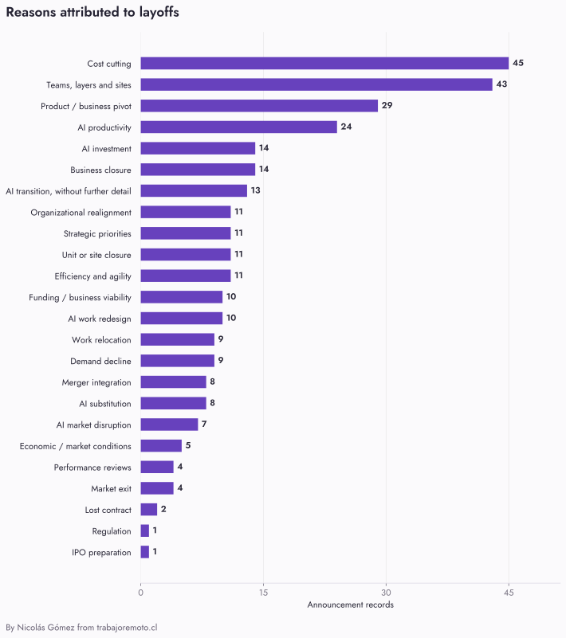
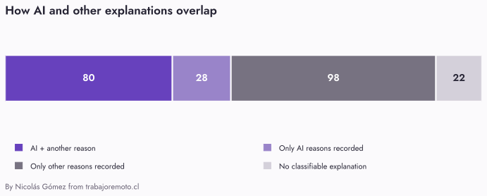
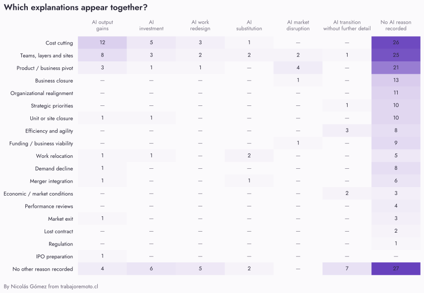
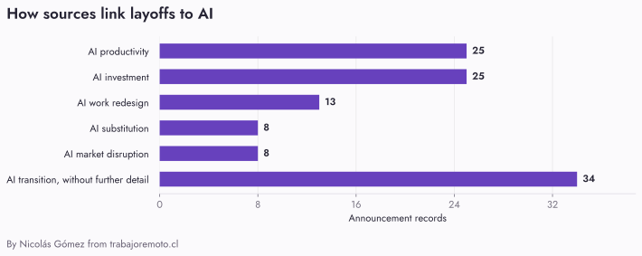
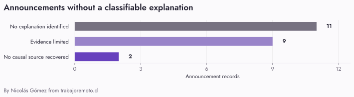

# What do companies say when they cut jobs?

*General coverage: September 17, 2026 · Classifications reviewed: September 28, 2026*

228 layoff announcements, all their attributed reasons, and the patterns that emerge when they are counted together.

A company links layoffs to AI, and the headline seems to offer a complete explanation. But it might mean smaller teams producing more, money moving into different products, tasks being replaced, or customers no longer needing the same service.

In this collection, **108 of 228 announcements have an explanation involving AI**. In **80 of those 108—nearly three in four—another reason is also attributed**, such as savings, consolidation or efficiency. AI frequently appears within a decision with several stated motives.

We start with Layoffs.fyi’s AI labels and add documented attributions. Eleven of the 108 links are retained from the tracker without independently corroborating its mechanism. That overlap is the starting point. This analysis counts every reason attributed to the announcement, including an AI transition without further detail. It does not allocate jobs to causes or turn source statements into independently demonstrated causal facts.

Counts and examples can be inspected in the [notebook with code, results and sources](../notebooks/explorar_despidos.html). Reproducing the calculations checks what was recorded; it does not prove the attributed explanations are the actual causes.

The three main findings concern prior workforce trajectories, the routes through which AI can affect employment, and organizational changes described alongside cuts.

## First, what are we counting?

We analyze **228 announcement records from January–June 2026**. We started with [Layoffs.fyi](https://layoffs.fyi/2026-layoffs/) and checked or supplemented each record using other sources. **206 announcements have a classifiable explanation**; the other **22** remain in the collection and are shown separately.

The unit is an announcement, not a company or a worker. Possible overlaps remain flagged for Expedia, Meta and Vimeo, plus Credit Karma within Intuit’s plan. Some plans extend beyond June. This is not a census of layoffs or a uniformly sampled monthly series.

[Inspect calculations and evidence in the notebook](../notebooks/explorar_despidos.html#poblacion)

## Savings and organizational changes lead the explanations

**Cost cutting appears in 46 announcements, consolidating teams, layers or sites in 43, and product or business pivots in 29.** Cost cutting and consolidation lead the collection; the general AI link appears in 34 announcements, ahead of product or business pivots.

*Figure 1. All attributed reasons are included, including general reorganization, efficiency and AI transition without further detail. Bars count overlapping announcements; adding them does not produce a unique announcement total.*

Categories preserve what each source says. Reorganization without further detail is counted as such; it does not become duplicated-role elimination by assumption. This includes the announcement without inventing the decision behind it.

[Inspect calculations and evidence in the notebook](../notebooks/explorar_despidos.html#razones)

## The explanations overlap

**108 announcements contain more than one attributed reason.** The most frequent pair is cost cutting and organizational consolidation, in 13 announcements. AI productivity and cost cutting also appear in 13, and financial distress and closure in 9.

A pivot toward AI products can appear as a business change and as AI investment or transition. These are overlapping descriptions, not necessarily independent motives.

*Figure 2. These four groups count every announcement once. “Only” describes reasons recovered from the sources; it does not establish the only causes that existed.*

Overlap also dominates AI-linked announcements: **80 combine AI with another reason, while 28 have only AI reasons recorded**. The 98 with only other reasons do not establish AI’s absence. Nor are the 22 without a classifiable explanation interpreted as “no AI.”

These are the most frequent AI pairs, including every tie at the fifth position:

| Reasons appearing together | Announcements |
|---|---:|
| AI productivity + cost cutting | 13 |
| AI productivity + organizational consolidation | 8 |
| AI investment + product or business pivot | 7 |
| AI investment + cost cutting | 6 |
| AI transition + product or business pivot | 6 |

These are co-occurrences within an announcement’s explanations. They do not tell us which motive mattered most or establish that a combination is more common than among companies that do not cut jobs. The matrix opens the records behind each pair.

*Figure 3. Each count opens its announcements. Rows and columns overlap; do not add them as independent groups.*

[Inspect calculations and evidence in the notebook](../notebooks/explorar_despidos.html#cruces)

## AI appears in six kinds of explanation

AI transition without a specified mechanism is the most frequent AI category, in **34 announcements**. Productivity appears in 25; other categories include AI investment (25), work redesign (13), task substitution (8) and AI market disruption (8).

*Figure 4. Bars total 113 assignments across 108 announcements. Productboard, Lastminute, Rapyd, Zap Africa and ZoomInfo each have two AI explanations.*

**A productivity expectation appears about three times as often as attributed task substitution: 25 versus 8 announcements.** This describes how the cuts are explained. It does not measure how much replacement happened or whether promised gains materialized.

Nor are AI connections constructed only by outside commentators: **23 of the 25 productivity attributions come from the company**, as do 19 of the 25 investment attributions. Fourteen of the 34 AI transitions without further detail are company statements. Who offers an explanation and whether it is true remain separate questions.

For example, [Optimove’s CEO](https://www.linkedin.com/posts/piniyakuel_the-ai-era-is-changing-what-it-takes-to-build-activity-7472616123805405185-p-j_) connects a 10% cut with an AI-first direction and announces tools and training. That counts as an AI transition. His message does not support assigning it to task replacement through automation.

[Inspect calculations and evidence in the notebook](../notebooks/explorar_despidos.html#atribuciones)

## Smaller teams, lower costs

Productivity appears in **25 announcements**. This is the explanation that AI allows a smaller workforce to do more, or to sustain output. Twenty-three of those accounts are company-attributed; one is press-reported and one is an explicit inference.

Specific substitution is attributed in eight announcements, including Salesforce as interpreted by an external analyst. We use that category when the source links AI or automation performing or eliminating work to the affected roles. It is a narrower statement than expecting a smaller team to become more productive. The smaller count should not be read as a census of actual replacement.

**Attribution matters too:** for Salesforce’s February round, a Forrester analyst interprets the cuts as AI substitution. That record counts as an external inference, not a Salesforce statement or demonstrated replacement. Zencity’s efficiency explanation comes from CTech’s headline, without a company statement.

[Block’s shareholder letter](https://www.sec.gov/Archives/edgar/data/1512673/000119312526076557/d108590dex991.htm) connects a smaller workforce to output enabled by intelligence tools. That supports a productivity attribution. It does not allocate individual eliminated jobs to particular automated tasks.

[Snap’s employee message](https://newsroom.snap.com/organizational-changes-at-snap) connects smaller teams with AI productivity and operating-cost savings. It is one of the 13 records in which those explanations coexist. The savings objective and the proposed means of achieving it are both worth recording.

LSports offers a particularly useful variation. Its CEO names AI-enabled work and increased labor costs, and says cuts would have been necessary without AI—but growth would have been slower. In that account, AI changes what the remaining workforce can deliver. It is not presented as the only reason to reduce staffing. [Company interview, via Geektime](https://www.geektime.co.il/l-sports-lays-off-40-employees-in-israel/).

For an engineering organization, the follow-up questions are practical. Did throughput improve before the decision, or is improvement expected afterward? Did the backlog shrink, or did fewer people inherit it? Do the measures include reliability, support load and rework, or just output volume?

The dataset does not answer those questions consistently. The finding is that productivity is repeatedly used to explain smaller teams. A useful next research step would be to test the reported gains against what those teams delivered after the reduction.

[Inspect calculations and evidence in the notebook](../notebooks/explorar_despidos.html#casos)

## Changing where the money goes

Fourteen announcement records explicitly connect cuts with investment in AI. The destinations include products, capabilities and roles as well as infrastructure. Calling every one of these “cuts to fund AI capex” would lose that distinction.

[Atlassian’s CEO](https://www.atlassian.com/blog/company-news/atlassian-team-update-march-2026) connects the reduction to funding AI and enterprise-sales investment while improving profitability. AI is one destination in a broader allocation decision.

[Autodesk’s employee message](https://adsknews.autodesk.com/en/news/012226-employee-message/) describes completing a go-to-market transformation and investing in AI, platform and industry-cloud capabilities. Both the organizational change and the reinvestment appear in the record.

[GitLab’s restructuring explanation](https://about.gitlab.com/blog/gitlab-act-2/) also links savings to its agentic product strategy, alongside fewer layers and a smaller employment-country footprint. This is recorded at the announced-plan level. It does not establish how much of any particular departure financed AI.

These cases suggest a different line of inquiry from task replacement: **what is the company choosing to buy, build or hire next?** A reduction in one function can coexist with expansion elsewhere. To evaluate that change, we would need the subsequent hiring, spending and role mix—not simply the size of the layoff announcement.

[Inspect calculations and evidence in the notebook](../notebooks/explorar_despidos.html#casos)

## When AI changes the business

ZoomInfo illustrates overlapping routes: executives describe AI-enabled development productivity and pressure on the seat-based software business. They connect lower demand for front-end development with a shift toward data consumption. The announcement therefore records productivity and market change alongside savings, relocation and a business pivot; it does not allocate all 600 positions to one reason. [May 11 earnings-call transcript](https://www.fool.com/earnings/call-transcripts/2026/05/11/zoominfo-gtm-q1-2026-earnings-call-transcript/).

Seven records describe AI disrupting the market, distribution or viability of a product. Four also describe a strategic pivot. This is another route through which AI can enter a layoff explanation, even when the affected workers’ tasks have not been automated.

At [Tailwind Labs](https://www.businessinsider.com/tailwind-engineer-layoffs-ai-github-2026-1), the founder connects AI with falling website traffic and paid conversions, then connects the revenue decline with future payroll constraints. The proposed chain runs through the business’s distribution and economics.

[Productboard’s CEO](https://www.linkedin.com/pulse/productboard-going-ai-only-heres-what-means-hubert-palan-h1ozc/) describes AI agents undermining the process-management work served by the earlier product, a pivot toward Spark, and a smaller team working with AI. That record contains distinct market-disruption and internal-productivity mechanisms, as well as the product pivot.

Yupp provides a closure example: its founders connect the service’s declining usefulness with rapid AI advances. [Reported by TechCrunch](https://techcrunch.com/2026/03/31/yupp-ai-shuts-down-33m-a16z-crypto-chris-dixon/).

Selling an AI product is not enough to qualify for this category. Nor is announcing a pivot toward AI. The source must connect a change in the business’s market or viability to the staffing decision. Otherwise, nearly any software-company strategy update could become evidence of AI-caused layoffs.

The open question here is whether AI is changing the amount of work required, the value customers attach to the work, or the route through which the company reaches those customers. Those changes call for different responses from an engineering team.

[Inspect calculations and evidence in the notebook](../notebooks/explorar_despidos.html#casos)

## What does an AI denial actually deny?

Six H1 records contain a company-attributed AI denial. Three also contain an AI-investment explanation. Reading the target of each denial resolves much of the apparent contradiction.

| Company | Target of the recorded denial | Other explanation in the record |
|---|---|---|
| Autodesk | Replacing people with AI | Go-to-market changes and investment including AI |
| Atlassian | Direct replacement by AI | Profitability and investment in AI and enterprise sales |
| GitLab | AI optimization or cost cutting as the purpose | Reinvestment, fewer layers and employment-location changes |
| Epic Games | An AI cause broadly | Lower engagement and spending exceeding revenue |
| Intuit | An AI cause broadly | Simplification and reallocation toward three priorities, including an AI platform |
| Uber | An AI cause broadly | Removing overlapping responsibilities and fragmented teams |

*Sources: company messages linked above; [Epic Games](https://www.epicgames.com/site/en-US/news/todays-layoffs); [Intuit CEO’s denial, reported by India Today](https://www.indiatoday.in/jobs/story/software-maker-intuit-to-cut-3000-jobs-ceo-says-layoff-has-nothing-to-do-with-ai-tchc-2914758-2026-05-21). [Uber’s company statement, reported by CNBC](https://www.cnbc.com/2026/06/03/uber-layoffs-people-division-ai.html). LinkedIn and Trend Micro have anonymous-source denials and are excluded from this company-denial count.*

A statement rejecting replacement does not reject every possible connection with AI. It can coexist with moving money into AI products. Each denial therefore needs to be read alongside its target: replacement, productivity, investment, or an AI connection broadly.

Does this happen more often at public companies? The evidence is too thin to answer. Five of these six records are tagged Post-IPO; Epic’s stage is Unknown in the tracker. Statements were not elicited uniformly, missing denials are not evidence of acceptance, and a listed parent and an acquired subsidiary are different reporting units. This is a research question, not a supported company-type comparison.

[Inspect calculations and evidence in the notebook](../notebooks/explorar_despidos.html#negaciones)

## Oracle shows why scope matters

Oracle illustrates two different links. [Contemporaneous reporting on the March plan](https://www.investing.com/news/stock-market-news/oracle-plans-thousands-of-job-cuts-as-data-center-costs-rise-bloomberg-news-reports-4544997) connects planned cuts to financing AI infrastructure. We record that press attribution at announced-plan scope; matching it to the March 31 execution is an explicit documentary inference.

The [March 10 company release](https://www.oracle.com/news/announcement/q3fy26-earnings-release-2026-03-10/) separately describes smaller development teams enabled by AI code generation. It remains plan-level context, without allocating every position in the round to productivity or replacement.

The March record includes general reorganization and a press-attributed AI investment rationale. The annual net decline of 21,000 remains separate and excluded from announcement counts: it combines hiring and departures rather than describing a new layoff round.

[Inspect evidence and scope in the notebook](../notebooks/explorar_despidos.html#oracle)

## Financial distress mostly appears alongside closures

**9 of the 10 announcements citing financial distress also include closing the company.** Conversely, 9 of the 14 closures have that explanation. This is a concentration within the collection, not an estimate of a financially distressed company’s closure risk.

The accounts differ: [Covrzy’s](https://inc42.com/buzz/antler-backed-covrzy-shuts-down-due-to-cash-crunch/) founder describes failed funding or acquisition attempts; [Rec Room](https://techcrunch.com/2026/03/31/social-gaming-platform-rec-room-once-valued-at-3-5b-is-shutting-down/) explains that it cannot operate profitably. The remaining financial-distress case is Tailwind Labs: the source connects falling revenue with difficulty sustaining payroll, without announcing a company closure.

This pair distinguishes a business situation that matters: **cutting jobs to continue operating and dismissing employees when closing are different decisions**. “Layoffs” brings both into the collection.

[Inspect calculations and evidence in the notebook](../notebooks/explorar_despidos.html#cierres)

## What work is being cut?

We identified affected functions in **62 of 228 announcements**. Engineering and R&D appears in 32, product and design in 20, and marketing in 13. Categories overlap because one announcement can affect several functions.

Within these records, engineering co-occurs with an AI explanation in 15 announcements, product and design in 11, and marketing in 9. These counts cannot rank occupational risk: we do not know the total exposed workforce and do not have uniform function coverage.

The main limitation comes before any comparison: **80 of the 108 AI-linked announcements have no specific affected function identified**. Knowing a company invokes AI does not tell us which work disappears. [Explore functions × explanations](explore.html#affected-functions).

[Inspect calculations and evidence in the notebook](../notebooks/explorar_despidos.html#funciones)

## The gaps are part of the findings

**22 announcements have no classifiable explanation**: 11 give no reason in the recovered material, 9 have insufficient evidence, and 2 have no causal source recovered. They remain in the denominator of 228.

*Figure 5. These are limits of the recovered information. They do not establish that the announcements lack a reason or an AI connection.*

**ADP’s** notice reports departures without a reason. For **Xero (February)**, the [BusinessDesk preview](https://businessdesk.co.nz/article/markets/xero-restructures-with-250-jobs-on-the-line) describes proposed restructuring, but we did not recover the full article or a sufficient alternative explanation. For **Dayforce**, the listing points to an internal memo unavailable for review. These are different evidence problems retained in each record.

Other questions remain unanswered by these cross-tabulations. Industry is unknown in 66 announcements, so a sector ranking would omit a substantial part of the collection. AI denials were not collected uniformly, preventing a behavioral comparison of public and private companies. Announcements also lack consistent measurements of productivity after the cuts.

[Inspect calculations and evidence in the notebook](../notebooks/explorar_despidos.html#vacios)

## Earlier workforce growth does not follow one trajectory

Linking announcement reasons to workforce histories gives median **2019–2022** growth of **+88.2% for the AI-linked group and +22.0% for the group with other reasons**, based on 22 and 12 companies respectively.

For **2022–2025**, the medians are close: **+6.7% with AI and +3.7% with other reasons**, across 40 and 27 companies. Fifteen of those 40 AI-linked companies had already reduced their net workforce during that period. A single story of continuous expansion before the cut does not describe the group.

These comparisons do not establish overhiring: the observable companies change, acquisitions are not fully adjusted, and a larger workforce can accompany a larger business. The [hiring study, in Spanish](contratacion.html), provides sources, distributions and sensitivity checks. It includes all attributed reasons, like this article, but counts each company once.

[Inspect calculations and evidence in the notebook](../notebooks/explorar_despidos.html#contratacion)

## Complete register and methodology

The article and explorer count all reasons attributed to the same **228 announcements**. Context, denials, attribution and scope remain separate. Explanation detail stays in the data for classification review; it does not divide these findings into two populations.

General reasons were not exhaustively re-coded alongside every account already describing a specific decision. Their counts and pairs reflect the recorded evidence and may omit additional source language.

Counts are generated from the records. Of the 228 announcements, 212 have reviewed sources, 14 partial evidence and 2 unrecovered sources. Those statuses do not independently corroborate every statement or headcount.

[Explore every record](explore.html) · [Analysis counts and cross-tabulations](analysis.json) · [JSON records](records.json) · [CSV](records.csv) · [Methodology](methodology.md) · [Individual source review, in Spanish](explorar.html#revision-de-las-explicaciones-generales)

[Inspect calculations and evidence in the notebook](../notebooks/explorar_despidos.html#comprobaciones)

<!--TRACKER-COMPARISON-->
## How do we extend Layoffs.fyi’s data?

**Its AI classifications are our starting point.** We retain its event labels and add attributions documented elsewhere. A difference requires a documented event or scope mismatch, correction, or later clarification about the same announcement. Failure to retrieve an article is not enough to discard its classification.

For January–June, the [AI Layoffs Tracker](https://layoffs.fyi/ai-layoffs/), retrieved September 28, 2026, labels **95 of 231 events as AI-related (41.1%)**. Our collection contains **108 of 228 (47.4%)**. The populations differ.

| Match result | Records |
|---|---:|
| Both record an AI reason | 91 |
| Only the tracker records AI, within our announcement population | 1 |
| Only our analysis records AI | 17 |
| Tracker period measures excluded from our announcements | 3 |

In **11 announcements**, the general AI attribution is retained from the tracker without independently corroborating its detailed mechanism. These are tracker attributions, not company confirmation or demonstrated replacement. In **8 other cases**, additional reporting or plan-level context completed our earlier reading. LinkedIn illustrates why a denial of replacing workers with AI can coexist with reporting on AI-oriented work redesign.

**Verily is the remaining event-scope exception:** the tracker describes the devices closure announced in August 2025, while our entry is a June 2026 notice. We do not automatically transfer one round’s explanation to another. The **17 additions** retain their own sources; absence from the tracker is not a documented rejection. Oracle, Dell and Multiverse are period workforce measures rather than three new announcements.

The tracker counts **90,277 of 109,017 employees (82.8%)** in AI-labelled events. This weights event size; it is not an announcement percentage or a count of individual jobs caused by each motive.

[Reproduce the matching and inspect provenance](../notebooks/explorar_despidos.html#comparacion-tracker) · [Download decisions and sources](../research/ai-tracker-comparison/comparison.csv).
<!--/TRACKER-COMPARISON-->
